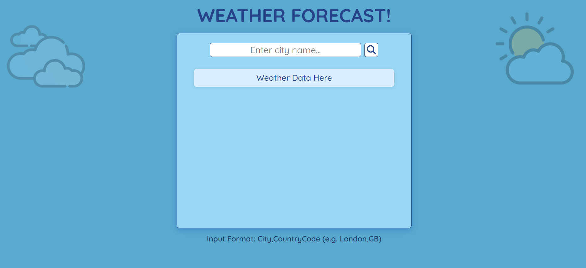

# 🌦️ Weather App

A responsive and visually appealing weather application built using **HTML**, **CSS**, and **JavaScript**. It fetches real-time weather data and forecasts using the **OpenWeatherMap API**.

## 🔗 Live Demo

[Click here to view the deployed app](https://erleen0307.github.io/weather-app/)

---

## 📸 Screenshots

### 🌤️ Current Weather


### 📅 Forecast


---

## 🚀 Features

- 🔍 Search weather by city name
- 📊 Displays min/max temperature, chances of precipitation, and weather conditions
- 📆 Shows 5-day / 3-hour weather forecast
- 🌐 Built entirely using frontend technologies (no frameworks)
- 🕘 Displays the 5 most recent searched cities as buttons
- 💾 Stores and loads recent search history using localStorage, allowing users to re-search with a click

---

## 🛠️ Tech Stack

- **HTML5**
- **CSS3**
- **JavaScript (Vanilla)**

---

## 📦 API Used

### 🌐 OpenWeatherMap API

- **Current Weather Data**
- **5-Day / 3-Hour Forecast**

📌 Sign up at [https://openweathermap.org/api](https://openweathermap.org/api) to get your **free API key**, and replace `"YOUR_API_KEY"` in the code.

---

## 🧑‍💻 How to Use

1. **Clone the repo**:
   ```bash
   git clone https://github.com/erleen0307/weather-app.git
   ```

2. **Open `index.html`** in your browser  
   OR deploy using GitHub Pages.

3. **Insert your OpenWeatherMap API key** in the JavaScript file:
   ```javascript
   const apiKey = "YOUR_API_KEY";
   ```

4. **Search** for any city and view live weather and forecast.

---

## 📂 Folder Structure

```
weather-app/
│
├── index.html
├── style.css
├── script.js
├── weather.png
├── forecast.png
└── README.md
```

---

### 📅 Date Completed: June 24, 2025
### ❤️ Made with love by <a href="https://github.com/erleen0307">erleen0307</a>

